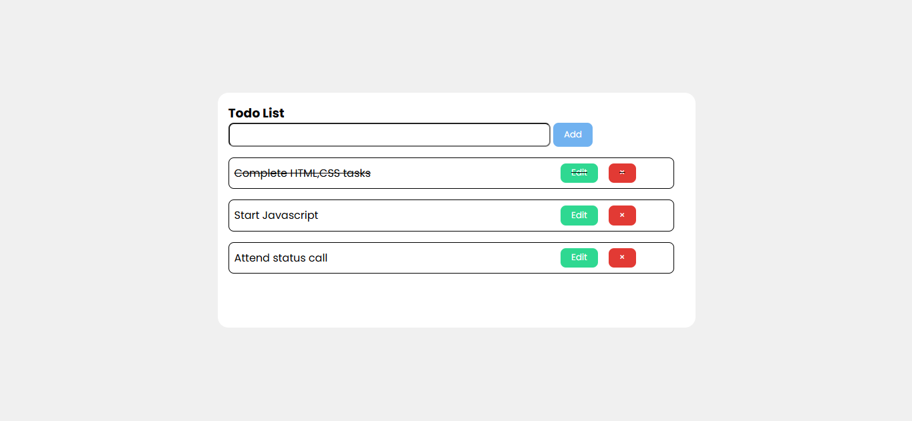
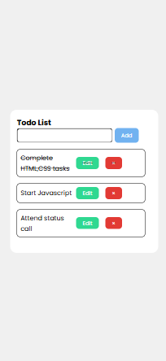

# Task 1: Interactive Multi-Page Website Simulator (CSS Only)


### 🎯Objective :

- Create a simple and interactive to-do list web app that allows users to add, mark as complete, and remove tasks dynamically using JavaScript.


###  🛠️ TechStack :

- HTML5
- CSS3
- JavaScript (Vanilla JS)

### 💡 Features :

- Add new tasks through an input field
- Mark tasks as completed (toggle)
- Remove tasks from the list
- Use of DOM manipulation to handle dynamic content
- Event listeners for user interactions (add, 
update, complete, delete)
-Save tasks using `localStorage` so they persist on page reload

### 🖼️ Screenshots

## 💻 Desktop View



## 📱 Mobile View




### 🚀 To Run :

```
    git clone https://github.com/PrashanthSai-K/Javascript-Fundamentals.git

    cd task1
```
- Now open the index.html file in any browser
