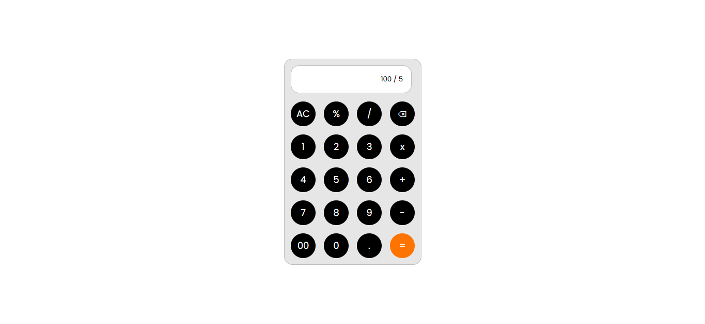
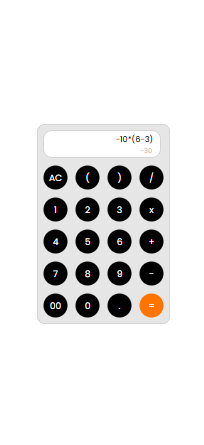

# Task 2: Simple Calculator


### 🎯Objective :

- Build a basic calculator web app that can perform arithmetic operations such as addition, subtraction, multiplication, and division using JavaScript.


###  🛠️ TechStack :

- HTML5
- CSS3
- JavaScript (Vanilla JS)

### 💡 Features :

- Number and operator buttons (0-9, +, -, ×, ÷, %)
- Clear (`C`), equals (`=`) and backspace buttons
- Included `( )` functionality with operator precedence using Infix to Postfix conversion
- Perform basic operations: addition, subtraction, multiplication, division and modulus
- Dynamic display of input and results
- Responsive layout for both desktop and mobile screens

### 🖼️ Screenshots

### 💻 Desktop View



### 📱 Mobile View




### 🚀 To Run :

```
    git clone https://github.com/PrashanthSai-K/Javascript-Fundamentals.git

    cd task2
```
- Now open the index.html file in any browser
