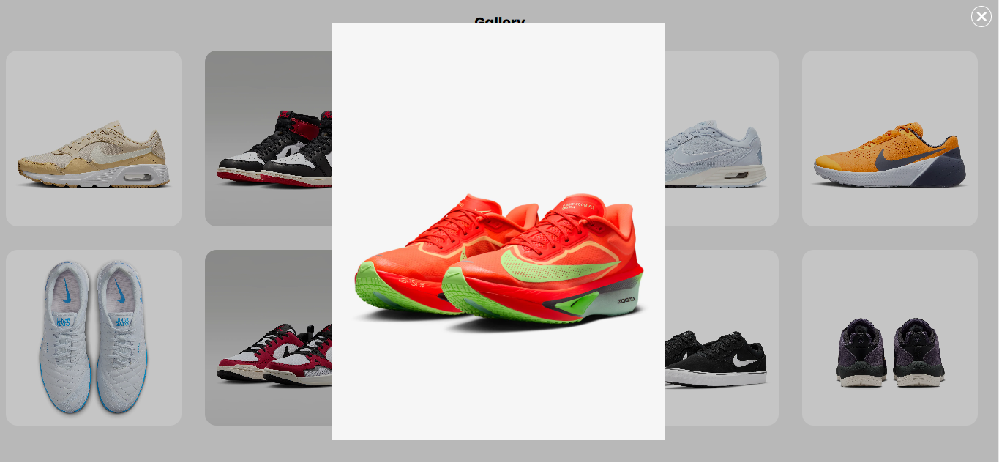
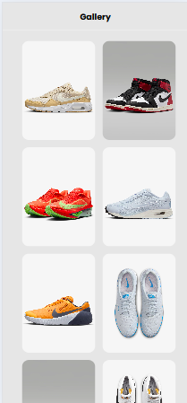
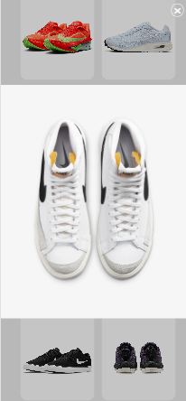

# Task 3: Image Gallery Lightbox


### 🎯Objective :

- Develop an image gallery where clicking a thumbnail opens a larger version in a modal/lightbox overlay.

###  🛠️ TechStack :

- HTML5
- CSS3
- JavaScript (Vanilla JS)

### 💡 Features :

- Clickable image thumbnails
- Lightbox modal to display a larger image view
- Smooth CSS transitions for modal appearance and closing
- Dynamic image loading in the modal using JavaScript
- Responsive gallery layout for different screen sizes

### 🖼️ Screenshots

### 💻 Desktop View





### 📱 Mobile View






### 🚀 To Run :

```
    git clone https://github.com/PrashanthSai-K/Javascript-Fundamentals.git

    cd task3
```
- Now open the index.html file in any browser
