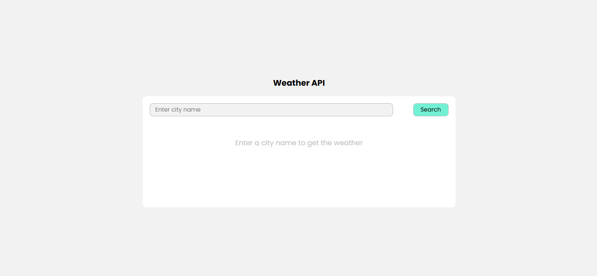

# Task 4: Weather App with API Integration


### 🎯Objective :

- Create a responsive weather application that fetches real-time weather information for a user-provided city using a public API.


###  🛠️ TechStack :

- HTML5
- CSS3
- JavaScript (Fetch API)
- Public Weather API (weatherapi.com)

### 💡 Features :

- Input field to enter the city name
- Fetch weather data dynamically using the Fetch API
- Display weather information including:
  - Temperature
  - Humidity
  - Weather description (e.g., Clear, Rain, Clouds)
- Error handling for:
  - Invalid city names
  - Network or API errors
- Mobile responsive UI

### 🖼️ Screenshots

### 💻 Desktop View




### 📱 Mobile View


### 🚀 To Run :

```
    git clone https://github.com/PrashanthSai-K/Javascript-Fundamentals.git

    cd task4
```
- Now open the index.html file in any browser
