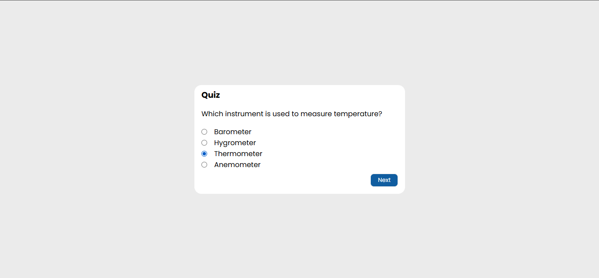
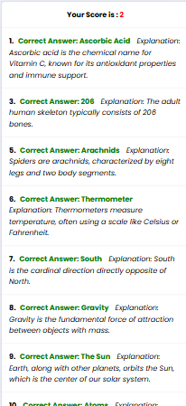

# Task 5: Dynamic Quiz Application


### 🎯Objective :

- Build a dynamic quiz app that loads questions on the fly, captures user input, and tracks the score in real-time.


###  🛠️ TechStack :

- HTML5
- CSS3
- JavaScript (Fetch API)

### 💡 Features :

- Dynamic loading of quiz questions and answer options
- Quiz data stored in a JavaScript object
- User interaction through clickable answers with event listeners
- Score calculation and result display at the end of the quiz
- Provided  explanations for each wrong answer
- Responsive design for mobile and desktop screens

### 🖼️ Screenshots

### 💻 Desktop View




### 📱 Mobile View





### 🚀 To Run :

```
    git clone https://github.com/PrashanthSai-K/Javascript-Fundamentals.git

    cd task5
```
- Now open the index.html file in any browser
