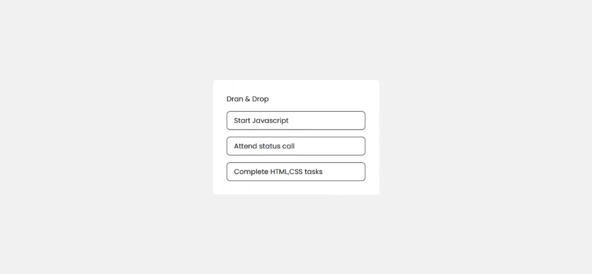
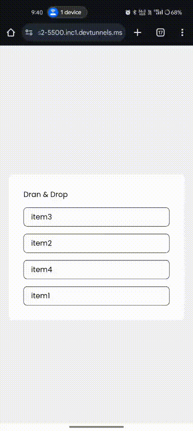

# Task 6: Drag and Drop List Reordering


### 🎯Objective :

- Create an interactive list that allows users to reorder items using drag-and-drop functionality while preserving the order using `localStorage`.


###  🛠️ TechStack :

- HTML5
- CSS3
- JavaScript (Drag & Drop API, localStorage)

### 💡 Features :

- Drag and drop items to rearrange the list dynamically.
- Uses the **HTML5 Drag & Drop API** for smooth interactions.
- Provides **visual feedback** during drag operations (e.g., highlights the drop target).
- **Persists the reordered list** using `localStorage` so that it remains unchanged after page reload.
- Responsive design for mobile and desktop screens

### 🖼️ Screenshots

### 💻 Desktop View




### 📱 Mobile View




### 🚀 To Run :

```
    git clone https://github.com/PrashanthSai-K/Javascript-Fundamentals.git

    cd task6
```
- Now open the index.html file in any browser
