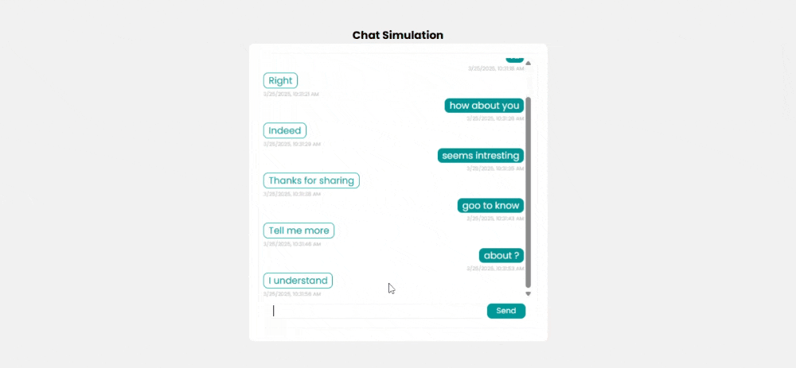

# Task 7: 🗨️ Real-time Chat Simulation


### 🎯Objective :

- Develop a simulated real-time chat interface where users can send messages and receive automated responses without a backend.


###  🛠️ TechStack :

- HTML5
- CSS3
- JavaScript (Message handling, simulated real-time interaction)

### 💡 Features :

- User can type messages and send them into the chat window. 
- Simulates real-time responses using `setTimeout()`. 
- Displays timestamps for each message. 
- Auto-scrolls to the latest message.  
- Responsive design for mobile and desktop screens.  

### 🖼️ Screenshots

### 💻 Desktop View




### 📱 Mobile View


### 🚀 To Run :

```
    git clone https://github.com/PrashanthSai-K/Javascript-Fundamentals.git

    cd task7
```
- Now open the index.html file in any browser
